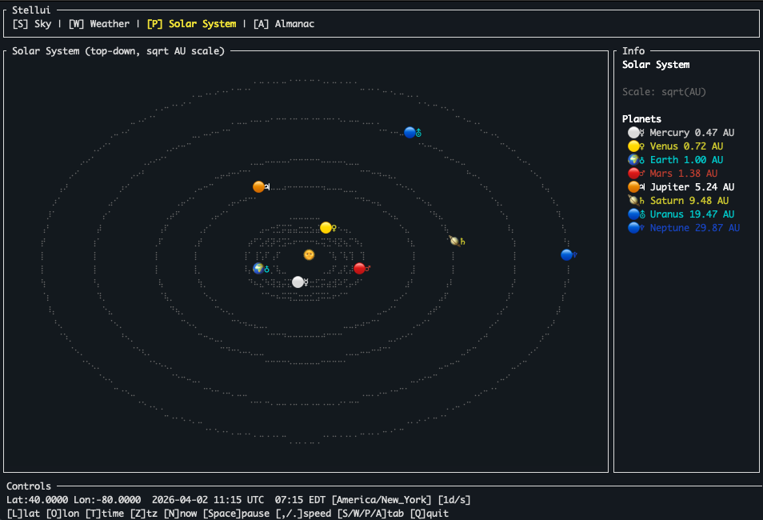

# stellui

A terminal planetarium — view the night sky and weather forecast from your command line.



## Features

- **Sky map** — stereographic projection of the visible sky with 9,000+ stars from the J2000 catalog
- **Sun & Moon** — real-time positions and moon phase
- **Solar system orrery** — animated top-down view of the planets
- **Almanac** — 24-hour radial altitude plot for the Sun and Moon
- **Weather forecast** — hourly seeing quality via [Open-Meteo](https://open-meteo.com/) with sparklines
- **Live mode** — auto-updates at ~60fps
- **Time travel** — simulate time at variable speeds (1x → 1 day/s) forward or backward
- **Local time** — timezone auto-detected from observer coordinates
- **Southern hemisphere** support

## Installation

```sh
cargo install --path .
```

Or run directly:

```sh
cargo run -- --lat 40.71 --lon -74.01
```

## Usage

```
stellui [--lat <degrees>] [--lon <degrees>] [--height <meters>]
```

Defaults to New York City (40.71°N, 74.01°W).

## Configuration

Settings are saved automatically on quit and loaded on startup from:

| Platform | Path |
|----------|------|
| Linux / macOS | `~/.config/stellui/config.toml` |
| Windows | `%APPDATA%\stellui\config.toml` |

CLI flags (`--lat`, `--lon`, `--height`) override the config file for that session.

Example config (see `config.example.toml`):

```toml
lat = 40.71
lon = -74.01
height = 0.0
# timezone = "America/New_York"  # auto-detected from lat/lon if omitted
# max_mag = 5.5  # Faintest magnitude to display (0 = brightest, 8 = very faint)
```

## Keybindings

| Key | Action |
|-----|--------|
| `s` | Sky tab |
| `w` | Weather tab |
| `p` | Solar System orrery tab |
| `a` | Almanac tab |
| `n` | Jump to now (live mode) |
| `Space` | Pause / resume simulation |
| `,` / `.` | Decrease / increase simulation speed |
| `l` | Edit latitude |
| `o` | Edit longitude |
| `t` | Edit date/time (`YYYY-MM-DD HH:MM` local time) |
| `z` | Edit timezone |
| `+` / `=` | Show fainter stars (increase magnitude limit) |
| `-` | Show fewer stars (decrease magnitude limit) |
| `r` | Refresh weather |
| `↑` / `↓` | Scroll weather forecast |
| `Enter` | Confirm input |
| `Esc` | Cancel input |
| `q` / `Ctrl+C` | Quit |

## Sky Map Orientation

The sky map uses a stereographic projection centered on the zenith:
- **South at top**, North at bottom
- **East at left**, West at right
- Stars beyond the horizon (altitude < 0°) are hidden

## Dependencies

- [astronomy-engine-bindings](https://crates.io/crates/astronomy-engine-bindings) — planetary positions
- [ratatui](https://ratatui.rs/) — TUI framework
- [Open-Meteo API](https://open-meteo.com/) — weather data (no API key required)

## License

MIT
